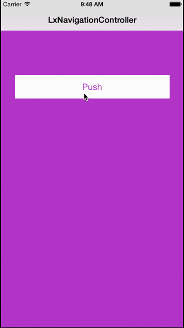

# LxNavigationController
    A convenient navigationController inherited from UINavigationController. LxNavigationController add a powerful gesture you can pop view controller only if you sweep the screen from left the right.
    
*	

Installation
------------
    You only need drag LxNavigationController.h and LxNavigationController.m to your project.
Podfile
------------
    pod 'LxNavigationController', '~> 1.0.0'
Support
------------
    Minimum support iOS version: iOS 7.0
Usage
----------
    LxNavigationController * nc = [[LxNavigationController alloc]initWithRootViewController:YOUR_VIEW_CONTROLLER];
    ......
    [nc pushViewController:NEW_VIEW_CONTROLLER];
    ......
License
-----------
    LxNavigationController is available under the Apache License 2.0. See the LICENSE file for more info.
